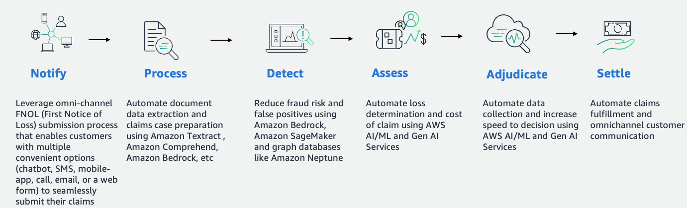
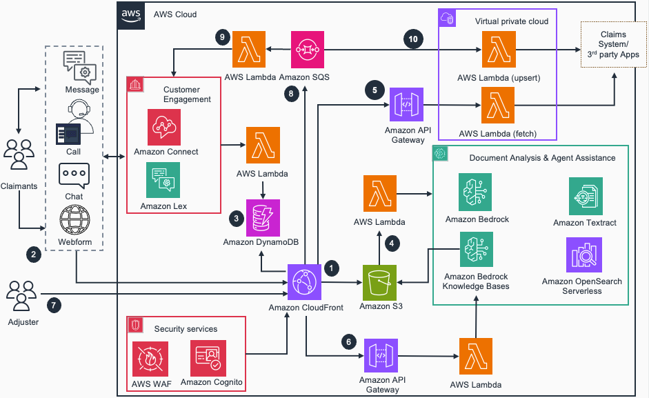

# Guidance for Omnichannel Claims Processing Powered by Generative AI on AWS

This repository contains guidance for implementing generative AI powered claims processing using Amazon Bedrock. This claims processing solution using generative AI leverages advanced AI capabilities to streamline, automate, and enhance the efficiency of the claims management process. This guidance provides step by step instructions for implementing First notice of loss (FNOL) solution to streamline auto insurance claims handling process, improve customer experience, and enhance the accuracy and efficiency of claims processing, including detecting and preventing fraudulent claims.

## Table of Contents

1. [Overview](#overview)
   - [Cost](#cost)
   - [Architecture](#architecture)
2. [Prerequisites](#prerequisites)
   - [Operating System](#operating-system)
   - [AWS account requirements](#aws-account-requirements)
3. [Deployment Steps](#deployment-steps)
4. [Deployment Validation](#deployment-validation)
5. [Running the Guidance](#running-the-guidance)
6. [Next Steps](#next-steps)
7. [Cleanup](#cleanup)
8. [Things to know](#things-to-know)
9. [Revisions](#revisions)
10. [Notices](#notices)
11. [License](#license)
12. [Authors](#authors)

## Overview

### Use Case Description:

Claims processing solutions using Generative AI (Gen AI) leverage advanced AI capabilities to streamline, automate, and enhance the efficiency of the claims management process. This section outlines different use-cases or capabilities within claims processing:


1. Automated Claims Triage: Automatically classify incoming claims based on their severity, complexity, and priority. Reducing the initial assessment effort  and routing to the appropriate resource for further action.
2. Fraud Detection and Prevention: Analyze patterns in claims data to detect and prevent fraudulent activities. By using machine learning algorithms, identify anomalies and suspicious behaviors such as inflated or duplicate claims submissions for the same incident. 
3. Damage Assessment through Computer Vision: Use computer vision AI to assess damage in auto insurance claims. Analyze the images submitted by claimant, estimate the repair costs, and provide a detailed report, significantly speeding up the damage assessment process and improving accuracy. 
4. Document Analysis & Summarization : Employ NLP to extract & summarize relevant information from unstructured documents like medical records, police reports, and claim forms, helping in validation of claims by cross-referencing extracted data with policy details and identifying any discrepancies. 
5. Automating Customer interaction : Improve customer interactions, and capture and analyze claims, by deploying access to new digital channels that span portals, mobile applications, call centers, chatbots, and voice.
6. Policy Compliance and Regulatory Reporting: Automate the monitoring and reporting of claims-related activities to ensure compliance.
7. Predictive Analytics for Claims Forecasting: Utilize AI to predict future claims trends and assess potential risks.

This guidance package focuses on streamline the claims handling process, providing omnichannel customer experience, and enhance the accuracy and efficiency of claims processing, including detecting and preventing fraudulent claims.

### High-Level process flow



- Leverage omni-channel FNOL (First Notice of Loss) submission process that enables customers with multiple convenient options (chatbot, SMS, mobile-app, call, email, or a web form) to seamlessly submit their claims
- Automate document data extraction and claims case preparation using Amazon Textract , Amazon Comprehend, Amazon Bedrock, etc
- Reduce fraud risk and false positives using Amazon Bedrock, Amazon SageMaker and graph databases like Amazon Neptune
- Automate loss determination and cost of claim using AWS AI/ML and Gen AI Services
- Automate data collection and increase speed to decision using AWS AI/ML and Gen AI Services
- Automate claims fulfillment and omnichannel customer communication


### Key personas

The key personas involved in claims processing in the insurance industry include claims adjusters/examiners, claims managers, customer service representatives, underwriters, fraud investigators, systems analysts, compliance officers, and data scientists/engineers.

### Target partners/customers
The target partners/customers come from various sectors within the insurance industry, such as health insurers, property and casualty (P&C) insurers, life insurers, third-party administrators (TPAs), legal firms, self-insured corporations, government agencies, and reinsurance companies.

### Architecture



The document presents an architecture that leverages various AWS services and generative AI capabilities to streamline the claims processing workflow, including:


1. Initiates First Notice of Loss (FNOL) communication using Amazon Connect and Amazon Pinpoint for Call and SMS, Amazon Lex for Chat using a webpage hosted through Amazon CloudFront. Amazon Simple Storage Service (Amazon S3) stores claims document.

2. Amazon CloudFront serves two web applications  - chatbot webpage hosted on Amazon S3 and claims processing webpage hosted on AWS Fargate. An Application Load Balancer load balances the traffic to Fargate. An AWS WAF protects Amazon CloudFront.

3. AWS Lambda function captures the data and stores them in an Amazon DynamoDB table. 

4. AWS Lambda invokes Amazon Textract to analyze a driver’s license and invokes Amazon Bedrock using Anthropic Claude 3 Haiku LLM to analyze images of vehicle damages. Amazon AWS updates the generated insights including potential cost to replace and repair the coverable to existing claims record in the Amazon DynamoDB table.

5. Adjuster leverages Amazon Bedrock Knowledgebase assistance to search information via Amazon API Gateway and AWS Lambda. Amazon S3 stores knowledge articles for the Bedrock knowledge base. An Amazon OpenSearch Serverless is used as the Vector database.

6. Adjuster reviews and adjudicates the claim request using the web application. 

7. Adjuster decision sends to Amazon Simple Queue Service (Amazon SQS) queue. 

8. Amazon SQS help integrates with a claims system or a 3rd party application for further processing (3rd party integration is not scoped in this guidance).

9. AWS Lambda notifies the claimant the status of the claim request via Amazon Pinpoint and/or Amazon Connect.


## Cost

### Sample Cost Table

The following table provides a sample cost breakdown for trying out this guidance package with the default parameters in the US East (N. Virginia) Region. While you try out, we assume you initiate ~10 claims, send 20 SMS and have 100 chat messages.

| Description | Service |  Cost [USD] | Configuration summary |
|-------------|----------|--------------|-------------------------|
|Customer Experience |Amazon Connect - SMS/Chat Cost|$0.72|Amazon Connect charges for 20 SMS (@0.01/SMS) and 100 chat messages(@0.040/message) with 2 TFN (@0.06/day)|
|Customer Experience |Amazon Pinpoint|$0.32| Amazon Pinpoint SMS charges for  20 SMS (@0.0075/inbound) and 20 SMS outbound (@0.00847/outbound)|
|Orchestration |AWS Lambda|$0.00| Free Tier ~ 5 API calls per claim and is covered as part of Free Tier.|
|AI/ML - Document extraction |Amazon Textract |$0.02| Extract and Analysis of 1 page (Driver's license) per claim @ $.02 per page|
|Generative AI - Image Processing | Amazon Bedrock |$2.88| Anthropic Claude 3 Haiku model used for damage assessment & summarization of images. Key assumptions - 1 image per claim , image format jpeg , 1 Mega pixel , 1 MB. ~1500 input tokens and 2000 output tokens|
|Generative AI - Knowledge assistance | Amazon Bedrock Knowledge bases (RAG)|$2.88| Amazon Claude Haiku model usage ~1500 input tokens and 2000 output tokens|
|Generative AI - Knowledge assistance | Open Search Serverless Vector DB |$1.20|$0.24 per OCU per hour each for Indexing & searching.$0.24 for storage. Priced for 2 OCUs|
|Notification and 3rd party integration | Amazon SQS |$0.00|Free Tier, ~ 20 messages and is covered under Free Tier|
|Load Balancer  | Amazon ELB |$0.03| ~ cost for 1 hr of usage, processed bytes ~1.5 MB per day|
|Webapplication hosting | AWS Fargate |$0.05| ~2vCPU , 2GB RAM for 1 hr usage|
|Webapplication hosting | Amazon CloudFront |$0.00| Free Tier, Max of 10000 requests, and is covered under Free Tier|
|Datastore |Amazon DynamoDB |$0.25| On-demand pricing with default settings. 1GB storage max with 1 KB average item size / 4 KB = 0.25 unrounded read request units needed per item.|
|Datastore | Amazon S3 |$0.05| S3 Standard storage (2 GB per month @$0.022 per GB), GET, SELECT, and all other requests from S3 Standard (100), PUT, COPY, POST, LIST requests to S3 Standard (100).|
|**Total** | - |$8.39|-|

More than 100 AWS products are available on AWS Free Tier today. Click [here](https://aws.amazon.com/free/) to explore our offers.

*Note: We recommend creating a [Budget](https://docs.aws.amazon.com/cost-management/latest/userguide/budgets-managing-costs.html) through [AWS Cost Explorer](https://aws.amazon.com/aws-cost-management/aws-cost-explorer/) to help manage costs. Prices are subject to change. For full details, refer to the pricing webpage for each AWS service used in this Guidance. For the most current and detailed pricing information for Amazon Bedrock, please refer to the [Amazon Bedrock Pricing Page](https://aws.amazon.com/bedrock/pricing/).*


## Prerequisites

This prototype uses AWS Customer Experience Services, such as Amazon Lex, Amazon Connect and Amazon Pinpoint. You need administrative experience to set up customer engagement channels via those AWS services for this prototype to work. More details about setting up those services can be found under `Deployment Steps` section below.

This prototype leverages Amazon Connect Two-way SMS feature and it requires a phone number to be claimed in Amazon Pinpoint service. This requires [registration process](https://docs.aws.amazon.com/sms-voice/latest/userguide/registrations-create.html) and can take more than 15 days. So it is advised to test this solution in a non-production environment where you have a Pinpoint phone number approved to be used. Also, if your pinpoint enviornment is a [sandbox environment](https://docs.aws.amazon.com/sms-voice/latest/userguide/sandbox.html), the target customer number used in `claimsprocessing/loadsampledata.py` to load DDBtableCustomerInfo Dynamodb tables (line 52) need to be [verified](https://docs.aws.amazon.com/sms-voice/latest/userguide/verify-destination-phone-number.html). 

To overcome the delay in the Pinpoint SMS nuber registration process, you can use an existing Pinpoint project and SMS phone number from a different AWS account. To enable cross account pinpont messaging, you can follow `Optional - Cross Account Pinpoint set up` under `Things to know` section below. Or you can follow the [blog](https://aws.amazon.com/blogs/messaging-and-targeting/how-to-implement-multi-tenancy-with-amazon-pinpoint/) or [workshop](https://github.com/aws-samples/multiple-accounts-multiple-amazon-pinpoint-projects) to set up the necessary settings to get the cross account services working.

### Operating System

These deployment instructions are optimized to best work [AWS Cloudshell](https://aws.amazon.com/cloudshell/).   Deployment using another Integrated Development Environment (IDE) or local enviornment may require additional steps such as configuring [AWS Cloud Development Kit](https://docs.aws.amazon.com/cdk/v2/guide/getting_started.html) and [python](https://www.python.org/about/gettingstarted/) detailed under [Tools](#Tools).

Before deploying the guidance code, ensure that the following required tools have been installed in your IDE:

- [AWS Cloud Development Kit (CDK) >= 2.126.0](https://aws.amazon.com/cdk/)
- [Python >= 3.9](https://www.python.org/downloads/release/python-390/)
- [AWS CLI v2](https://aws.amazon.com/cli/)

### AWS account requirements

**Required resources:**

- [Bedrock Model access](https://docs.aws.amazon.com/bedrock/latest/userguide/model-access.html)
   - Claude 3 models 
      - Haiku 3 for vehicle image analaysis - anthropic.claude-3-haiku-20240307-v1:0
      - Claude v2 (anthropic.claude-v2) and Claude v2.1 (anthropic.claude-v2:1) for Amazon Lex generative AI features
   - Amazon Titan Text Embeddings V2 - amazon.titan-embed-text-v2:0 for Knowledge assistance embedding
- [Amazon S3](https://aws.amazon.com/s3/)
- [Amazon VPC](https://docs.aws.amazon.com/vpc/latest/userguide/what-is-amazon-vpc.html)
- [AWS Lambda](https://aws.amazon.com/lambda/)
- [Amazon DynamoDB](https://aws.amazon.com/dynamodb/)
- [Amazon SQS](https://aws.amazon.com/sqs/)
- [Amazon Textract](https://aws.amazon.com/textract/)
- [Amazon Lex](https://aws.amazon.com/lex/)
- [Amazon Connect](https://aws.amazon.com/lex/)
- [Amazon Pinpoint](https://aws.amazon.com/pinpoint/)
- [AWS IAM](https://aws.amazon.com/iam/)
- [AWS CDK](https://docs.aws.amazon.com/cdk/v2/guide/getting_started.html)


VPC Availability: Ensure that at least one additional VPC slot is available in your account, as the default limit is typically 5 VPCs per region.

### Requesting Access to AWS Bedrock

1. Log in to the AWS Management Console
2. Search for "Bedrock" in the search bar
3. Click "Get Started" on the Amazon Bedrock service page
4. Click "Manage Model Access" in the popup
5. Select "Amazon" from the list of available models
6. Click "Request Model Access" at the bottom of the page

### Supported Regions

The guidance package is well suited to be deployed in `us-west-2` and `us-east-1` regions. However you can verify the availability of services listed in the architecture above (specifcally Amazon Bedrock, Amazon Pinpoint, Amazon Connect and Amazon Lex) and opt a region where all those services are supported.

### AWS CDK

This Guidance uses AWS CDK. If you are using aws-cdk for the first time, please see the [Bootstrapping](https://docs.aws.amazon.com/cdk/v2/guide/bootstrapping.html) section of the AWS Cloud Development Kit (AWS CDK) v2 developer guide to learn about AWS CDK.

## Deployment Steps

### 1. Set up and verify customer experience services 

If you have an existing Amazon Connect instance and wanted to use that instance, SKIP the instance creation step below and follow the steps to import the contact Flow (step 2). 
   
   1. To set up Amazon Connect instance, follow the insutructions [set up your Amazon Connect instance](https://docs.aws.amazon.com/connect/latest/adminguide/amazon-connect-instances.html)

   2. [Import the sample contact flow](https://docs.aws.amazon.com/connect/latest/adminguide/contact-flow-import-export.html#how-to-import-export-contact-flows) `GP-FSI-ClaimsProcessing.json` given under `source/AmazonConnect/ContactFlow`
      Log in to your Amazon Connect instance. The account must be assigned a security profile that includes edit permissions for flows.
      - Log in to your Amazon Connect instance.
      - On the navigation menu, choose `Routing`,  `Flows`.
      - Click on 'Create flow'
      - Select `Import (beta)` option under the drop down next to 'Save'
      - 'Choose` the file (GP-FSI-ClaimsProcessing.json) to import 
      - Once we deploy the stack and have the Amazon Lex chatbot and AWS Lambda added to your connect instance, we will review and update any resolved or unresolved references as necessary prior we `Save and Publish` the flow (instructions given under `Amazon Connect Changes Contact Flow changes` of `Make updates based on CDK resources` section).

If you have an existing Amazon Pinpoint Project and a phone number with two way SMS in Amazon Connect enabled, SKIP to CDK Deployment. To set up Amazon Pinpoint project and phone numer with Amazon Connect two way SMS enabled, follow the insutructions below:

   3. [Create a new project using the Amazon Pinpoint console](https://docs.aws.amazon.com/pinpoint/latest/userguide/gettingstarted-create-project.html)

   4. [Claim a phone number with two way SMS in Amazon Connect](https://docs.aws.amazon.com/connect/latest/adminguide/setup-sms-messaging.html)

   5. [Map the two-way phone number](https://docs.aws.amazon.com/connect/latest/adminguide/associate-claimed-ported-phone-number-to-flow.html) to the `GP-FSI-ClaimsProcessing` contact flow.
   

### 2. CDK deployment

Refer the Code Walkthrough and Deployment video given below:

.


   1. In your IDE (example: AWS Cloudshell), use the terminal to clone the repository:
       ```
       git clone https://github.com/aws-solutions-library-samples/sample_code_for_FSI_ClaimsProcessing_auto_workshop.git
       ```

   2. Navigate to the folder: sample_code_for_FSI_ClaimsProcessing_auto_workshop using
       ```
       cd sample_code_for_FSI_ClaimsProcessing_auto_workshop
       ```
   3. Make changes to the default values given.

      - The file named  `deploy.sh` takes care of CK set up, deploying CDK stacks and deploying other necessary resources. You can edit `deploy.sh` file to update values for Pinpoint_app_id [Pinpoint_app_id](https://docs.aws.amazon.com/pinpoint/latest/userguide/projects-manage.html) and Pinpoint_origination_number (Phone number claimed in Pinpoint) to have the SMS feature working. 
      - The file named `loadsampledata.py` under `claimsprocessing` folder has some sample data that we loads to DynamoDB tables. Edit `loadsampledata.py` to enter a valid phone number instead of `+1234567890` in line 52 of `loadsampledata.py` which loads DDBtableCustomerInfo with the sample customer data. You can edit other default sample values as we if needed.


   4. **Run** the file named `deploy.sh`
      ```
       sh deploy.sh
       ```
      The `deploy.sh` file on this folder will do the following things:
        1. This project is a Python Project. Commands to switch to the Virtual Env, activate virtual env and install the required dependencies in the virtual environment.
        2. Initialize CDK within the project using the command: ```cdk init```
        3. Bootstrap the CDK environment using the command :```cdk bootstrap```
        4. Verify that the CDK deployment correctly synthesizes the CloudFormation template:```cdk synth```
        5. Deploy the Backend Components running the following command: ```cdk deploy```
    
      **Note**:

         Running `deploy.sh` file will deploy 4 stacks, `ClaimsProcessingStack1`, `ClaimsProcessingStack2`,  `ClaimsProcessingStack3`, `ClaimsProcessingStack4`. 
         
         The resources used in the Streamlit app get deployed by `ClaimsProcessingStack3` needs to be updated using the resorcues from `ClaimsProcessingStack1`. `ClaimsProcessingStack2` is used for the same.

         The deployment loads sample data to dynamodb tables created as part of this stack. File named `loadsampledata.py` is used for loading sample data to dynamodb tables. You can edit the sample dataset by editing `claimsprocessing/loadsampledata.py`. Please make sure to enter a valid phone number in line 52 of `loadsampledata.py` which loads DDBtableCustomerInfo with the sample customer data.

         The file named `setup_AmazonBedrock_kb.py` under claimsprocessing folder is used for setting up a Bedrock knowldgebase and associated resources such as Open Serach vector database and collection, it's policies, running an embedding job to parse the sample data kept under Knowledgebase folder in the s3 bucket created as part of the Stack1. If you already have a knowledge base that you wanted to use, you can comment out line 53 and 54 of `deploy.sh` file.
         
         File named `LexImport.py` under `claimsprocessing/LexImport.py` is used for importing the sample bot, buidling it and makes sure the alias has the `gp-fsi-claimprocessing-filenewclaim` Lambda associated as the Lambda codehook.

         You can change the resource names by editing the enviornment variables set in the `deploy.sh` file.
      
      It will take approximately *20 minutes* to deploy the entire stack. 


   ### Deployment Validation
    
   1. Verify a successful deployment of the CDK stack and CloudFormation stacks:
      - Open [CloudFormation](https://console.aws.amazon.com/cloudformation/home) console 
      - Verify that the status of the stacks named `ClaimsProcessingStack1`, `ClaimsProcessingStack2`, `ClaimsProcessingStack3`, and `ClaimsProcessingStack4` is `CREATE_COMPLETE`
      - For each stack, you can click on `resources` tab which shows all the resources created by the stack.

   2. Check Amazon dynamodb tables and sample data:
      - Open the Amazon DynamoDB console
      - Go to `Tables`
      - Check for tables with the name GP-FSI-ClaimsProcessing-* 
      - Click on tables and click on Exmplore table items. Except GP-FSI-ClaimsProcessing-NewClaim table, you should see data in rest of the tables.

   3. Verify that an Amazon Lex bot is imported:
      - [Open the Amazon Lex console](https://console.aws.amazon.com/lex/).
      - You should see an Amazon Lex bot named `GP-FSI-Claims-Processing`

   4. Verify that the Amazon Bedrock Knowldgebase is created: 
      - [Open the Amazon Bedrock console](https://console.aws.amazon.com/bedrock/).
      - Go to `Builder tools` in the left pane by expand the burdger icon, click `Knowledge bases`
      - Click the one named `gp-fsi-claims-processing-knowledge-base`
      - Click the "Data source name" under `Data source`section
      - Check the `Sync history` with status `Complete` and `Source files` count as 1

   - If there are errors while running the python scripts, it will give error details that you can check and resolve

### 3. Make updates based on CDK resources

   1. Amazon Connect Changes Contact Flow changes

      - [Add the Amazon Lex bot created/imported to the Amazon Connect instance](https://docs.aws.amazon.com/connect/latest/adminguide/amazon-lex.html) 
      - [Add the Amazon Lamda named](https://docs.aws.amazon.com/connect/latest/adminguide/connect-lambda-functions.html#add-lambda-function) `gp-fsi-claimprocessing-notification` created by the CDK stack to the Amazon Connect instance 
      - Update Contact Flow imported: update `Get customer input` with the Lex details, `Invoke AWS Lambda function` with the lambda added, and select a `queue` and publish the flow

   2. A sample customer webpage for Amazon Connect Chat will be created by the Stack. We need to update the Connect chat info in the `home.html` file kept under S3 bucket and folder named `SampleConnectchatUI`
      - You can add Amazon Connect chat user interface to a webpage by configuring the communications widget in the Amazon Connect admin website as detailed [here](https://docs.aws.amazon.com/connect/latest/adminguide/add-chat-to-website.html). While configring the communications widget, in the Communications options section, choose `Chat` option for your customers to engage with your widget (you can ignore `Web calling`), and then choose Save and continue. 
      - You can select the Contact Flow `GP-FSI-ClaimsProcessing` created earlier
      - For the option to `Add security for your communications widget`, you can opt `No` 

         Note: To add security for your chat communications widget to have more control when initiating new chats, including the ability to verify that chat requests sent to Amazon Connect are from authenticated users, you can follow [this documentation ](https://docs.aws.amazon.com/connect/latest/adminguide/add-chat-to-website.html#confirm-and-copy-chat-widget-script)

      - COPY and Paste the `Communications widget script` into line 81-93 in the `home.html` page kept under `SampleConnectchatUI` of the S3 bucket (you can download the file, make changes and upload it back, make sure that the file name is matching)
      - Also note that the `WebsiteURL` from the output of `ClaimsProcessingStack1` stack (CloudFront URL) needs to be added as an approved domain to your communication widget as instructed [here](https://docs.aws.amazon.com/connect/latest/adminguide/add-chat-to-website.html#chat-widget-domains)

   3. Informational: A sample Amazon Lex will be created by the Stack using the file named `LexImport.py` under `claimsprocessing` folder. It will import a sample bot, buid it and creates an alias with `gp-fsi-claimprocessing-filenewclaim` Lambda associated for the Lambda codehook. The sample Amazon Lex `GP-FSI-ClaimsProcessing-sample.zip` shared as part of this guidance package is imported.
   
   If needed, you can manually import the sample Amazon Lex following [this](https://docs.aws.amazon.com/lex/latest/dg/export-to-lex.html) or given below :
      - Download `GP-FSI-ClaimsProcessing-sample.zip` given under the path `source/Amazon Lex` 
      - Using Amazon Lex console, under `Actions` use the `Import` opion to [import the Zip file to create the bot](https://docs.aws.amazon.com/lexv2/latest/dg/import.html)
      - Select the bot and [build the bot](https://docs.aws.amazon.com/lexv2/latest/dg/building-bots.html) (Go to Versions -> All languages -> Language: English (US)), click `build` 
      - [Deploy the bot](https://docs.aws.amazon.com/lexv2/latest/dg/deploying.html) - create a version of the latest build and create an alias with the latest version of the bot 

   4. An Amazon Bedrock Knowledgebase named `GP-FSI-ClaimsProcessing` will be created by the stack using the file `setup_AmazonBedrock_kb.py` under `claimsprocessing` folder. However, below given the instructions to create Amazon Bedrock Knowledgebase manually from AWS console if needed:
   
      - Navigate to Amazon Bedrock Knowledge base in AWS console 
      - Provide a knowledge base name.
      - Further, provide the S3 URI of the object containing the files for the data source that got created as part of the stack deployment, that is, select the S3 as data source to your Knowledge base setup that got created due to CDK deployment.
      - For this, click `browse s3` and select bucket starting with the name - `claimsprocessing-<account name>`. Some sample knowledgebase articles are stored under 'Knowledgebase' folder in that S3 bucket.
      - Next, you can keep the chunking strategy as "default", select `Titan Text Embeddings v2` model to embed the information and select `Quick create a new vector store` in order to have default option for the vector DB when creating the knowledge base. Note that Knowledge Base can take approximately 10 minutes to be created.
      - Take note of the `knowledge base ID` once the knowledge base has been created. If you do this manually, this value needs to be added/updated to the DynamoDB table named `GP-FSI-ClaimsProcessing-FM`. 
      - [Refer](https://docs.aws.amazon.com/bedrock/latest/userguide/knowledge-base-create.html) to create your own Bedrock Knowledge Base with Opensearch serverless vector DB in your account.


## Guidance Demo

Now that all the configuration steps are completed, you should be able to open the Cloudfront URL as detailed above and start playing with the app.

.

## Submit FNOL

### Via Webform 

  1. Go to CloudFormation stacks, open `StreamlitURL` given in the `Outputs` tab of `ClaimsProcessingStack3`.
  2. In the 'Initiate a new claim', you can enter your policy number (eg: PY1234)
  3. If you have Amazon Pinpoint configured to send messages to your number, you will recieve the one time password (OTP) and final notification. If you dont have pinpoint configured, for getting the OTP, you can check the items in the DynamoDB table named `GP-FSI-ClaimsProcessing-NewClaim` to find the 6 digit number after the sample policy number PY1234 as your OTP. This is a workaround for testing with out Amazon Pinpoint configured for OTP.
  4. Enter the OTP and once verified, you will be given option to enter the details of the incident.
  5. Once you have the details filled, **click** the `Submit` button and a case will be opened. Make a note of the Case number (policy number+OTP). 

### Via Chatbot

 1. Go to CloudFormation stacks, open `WebsiteURL` given in the `Outputs` tab of `ClaimsProcessingStack1`.
 2. Use the sample login name: `MariaG` and password `Test`. You can change the sample login and password hardcoded in line 28 of the `index.html` file kept under `AmazonConnect/SampleConnectChatUI` folder. Also, you can have your own authentication mechanisms added to this page as well.
 3. Once authenticated, you will see a chatbot icon at the bottom right. As instructed in SetupCSTools section earlier, this webpage needs to be added an approved origin in the Amazon Connect Chat widget, have the chat widget is mapped to use 'GP-FSI-ClaimsProcessing' contact flow and have the  and the script from Amazon Connect chat widget is used in the `home.html`, the chat icon will get a contact initiated. 
 4. While interacting with the chatbot, you will be prompted to enter the OTP for authentication. If you have Amazon Pinpoint configured to send messages to your number, you will recieve the one time password (OTP). If you dont have pinpoint configured, you can enter "999999" as an OTP. This is a workaround for testing with out Amazon Pinpoint configured for OTP.
 
 Note: To add security for your chat communications widget to have more control when initiating new chats, including the ability to verify that chat requests sent to Amazon Connect are from authenticated users, you can follow [this documentation ](https://docs.aws.amazon.com/connect/latest/adminguide/add-chat-to-website.html#confirm-and-copy-chat-widget-script).

### Via SMS

1. To the Amazon Connect two way SMS phone mapped to the `GP-FSI-ClaimsProcessing` contact flow, send a sample SMS (eg: Hi) and the two way SMS conversation will start.

## Upload supporting documents
  - Using the case id, you can upload the supporting documents via `GP-FSI-Claims-Processing-Upload-Documents` page of the streamlit app.
  - You will be promoted to upload your DL and accident images.
  - Once the images are uploaded, the documenta validation and image analysis will happen behind the scenes.
 
## Adjudicate the claims
  -   For Agents to validate the supporting documents and adjudicate, use the `GP-FSI-Claims-Processing-XperienceCenter` page of the streamlit app.
  -   In the left pane, agent can ask questions that is powered by Bedrock knowledge bases. For example, the can ask `What is the Average Collision Repair Cost?`
  -   In the main pane, agent can see all tickets and see the status and choose the tickets to review.
  -   For those selected ticketsm, agents will get details around the Drivers linces validation and image analysis completed.
  -   Using those, agent can take a decision to approve/reject or ask for more details
  -   Once agent click the submit button, the decison will be recorded in the `GP-FSI-ClaimsProcessing-NewClaim` tables and a message will be send to the customer (provided pinpoint is configured to send the SMS)

Note: To potentially achieve more accurate or tailored results, we encourage you to experiment with editing the prompts you provide to the model (edit the prompts given in `GP-FSI-ClaimsProcessing-FM` DynamoDB table). By modifying the prompts, you can often guide the model to generate outputs that are more closely aligned with your requirements.

## Next Steps

Here are some suggestions and recommendations on how customers can modify the parameters and components of the Claims Processing application to further enhance it according to their requirements:

1. **Customization of the User Interface (UI)**:
   - Customers can customize the frontend to match their branding and design requirements.
   - They can modify the layout, color scheme, and overall aesthetic of the application to provide a seamless and visually appealing experience for their users.
   - Customers can also integrate the application with their existing web or mobile platforms to provide a more cohesive user experience.

2. **Expansion of the Knowledge Base**:
   - Customers can expand the knowledge base by ingesting additional data sources for claims processing.
   - This can help improve the quality and relevance of the accident image analysis provided by the application.
   - Customers can also explore incorporating user feedback and interactions to continuously refine and update the knowledge base.

3. **Integration with External Data Sources**:
   - Customers can integrate the application with additional data sources, such as ERP, CRM systems or vehicle data systems.
   - This can enable more comprehensive and context-aware analysis, taking into account factors like vehicle parts pricings, existing claims history, etc.

4. **Advanced Analytics and Reporting**:
   - Customers can integrate the application with business intelligence and analytics tools to gain deeper insights into user behavior, recommendation performance, and overall application usage.
   - This can help customers make data-driven decisions to further optimize the Claims Processing and better align it with their business objectives.
   
5. **Integration with other Applications or Solutions**:
   - Customers can integrate the application with External Applications or Solutions for various use cases for claims processing.
   - For example: you can use an AWS partners for claims management, data analysis,  or claims prediction, etc


By exploring these next steps, customers can tailor the Claims Processing application to their specific needs, enhance the user experience, and unlock new opportunities for growth and innovation within their FSI Claims processing businesses.

## Cleanup

### Cleanup of CDK-Deployed Resources

1. **Terminate the CDK app**:
   - Navigate to the CDK app directory in your Cloud9 terminal. In your case, go to the git repo
   - Run the clean up script  `sh destroy.sh <aws-region>`  eg: `sh destroy.sh us-east-1`
   - This should Amazon Lex imported, and Bedrock knowledgebase, delete the CloudFromation stacks and related resources

2. **Verify resource deletion**:
   - Log in to the AWS Management Console and navigate to the relevant services to ensure all the resources have been successfully deleted.

### Manual Cleanup of Additional Resources

1. **S3 Bucket Content**:
   - The Claims Processing application may use an S3 bucket to store generated images or other unstructured data.
   - If the S3 bucket was not managed by the CDK app, you will need to delete the contents of the bucket manually.
   - Log in to the AWS Management Console and navigate to the S3 service.
   - Locate the S3 bucket used by the application and delete all the objects within it.
   - Once the bucket is empty, you can delete the bucket itself.


## Things to know

- Please note that in this guidance package, Streamlit application was deployed in ECS fargate and servred to end users via Amazon Cloudfront distribution. Customer can opt their preferred web hosting/UI mechanisms than using Streamlit app.

- Additionally, for this PoC guidance package, DynamoDB was used to store the metadata. You have the option to choose other datastores as well

- This prototype expects a pinpoint project exists in your AWS account and have a phone number registrted for testing. If you have Pinpoint configured to send messages to your number, you will recieve the OTP and final notification. If you dont have pinpoint configured or get an error message saying "Not able to send message", you can open the DynamoDB table named GP-FSI-ClaimsProcessing-NewClaim to find the OTP as temporory workaround for testing purpose. The OTP is the number after the Policy Number (eg: 123456 in Case Number field PY1234-123456).

### Optional - Cross Account Pinpoint set up

To overcome the delay in the Pinpoint SMS nuber registration process, you can use an existing Pinpoint project and SMS phone number from a different AWS account. To enable cross account pinpont messaging, you can follow the instructions given below.

#### In the AWS account where Pinpoint is setup

1. If you create a new role, (eg: `cross_account_assume_role_claimsprocessing_pinpoint`), add an inline policy to the role as follows. If you are using the existing role, go to step 2 to set up cross account assume permission.
   ```
   {
      "Version": "2012-10-17",
      "Statement": [
         {
               "Action": [
                  "mobiletargeting:GetSmsChannel",
                  "mobiletargeting:SendMessages",
                  "mobiletargeting:PhoneNumberValidate"
               ],
               "Resource": [
                  "arn:aws:mobiletargeting:<region-name>:<pinpoint account name>:*"
               ],
               "Effect": "Allow"
         },
         {
               "Action": [
                  "logs:CreateLogStream",
                  "logs:PutLogEvents",
                  "logs:CreateLogGroup"
               ],
               "Resource": [
                  "arn:aws:logs:<region-name>:<pinpoint account name>:*"
               ],
               "Effect": "Allow"
         }
      ]
   }
   ```

2. Add the assume role permissions for the streamlit app role and notification Lambda execution role as follows:

   ```
   {
   "Version": "2012-10-17",
   "Statement": {
      "Effect": "Allow",
      "Action": "sts:AssumeRole",
      "Resource": [
      "arn:aws:iam::<Deployment account number>:role/<ClaimsProcessingStack3-AppExecuteRole*>",
      "arn:aws:iam::<Deployment account number>:role/<ClaimsProcessingStack3-gpfsiclaimprocessingnotifica-*>",
      ]
   }
   }
   ```

   - Replace `<ClaimsProcessingStack3-AppExecuteRole*>` with the `AppExecuteRole` created by `ClaimsProcessingStack3` cloudformation stack.
   - Replace `<ClaimsProcessingStack3-gpfsiclaimprocessingnotifica-*>` with the `gp-fsi-claimprocessing-notification` Lambda ServiceRole created by `ClaimsProcessingStack3` cloudformation stack.

#### In the AWS account where CDK stack is deployed

   1. Edit the `AppExecuteRole` created by `ClaimsProcessingStack3` cloudformation stack to add the below inline policy:

```
{
  "Version": "2012-10-17",
  "Statement": {
    "Effect": "Allow",
    "Action": "sts:AssumeRole",
    "Resource": [
	"arn:aws:iam::<Pinpoint account number>:role/cross_account_assume_role_claimsprocessing_pinpoint"
    ]
  }
}
```
   2. Edit the `gp-fsi-claimprocessing-notification` Lambda ServiceRole created by `ClaimsProcessingStack3` cloudformation stack to add the aove inline policy.

   [Reference 1](https://docs.aws.amazon.com/IAM/latest/UserGuide/access_policies-cross-account-resource-access.html)
   [Reference 2](https://docs.aws.amazon.com/IAM/latest/UserGuide/tutorial_cross-account-with-roles.html)

#### Make code changes to Notification Lambda and Initiate Claim page of Streamlit App

1. Below given a sample code of sending cross account pinpoint messages:

```
import boto3
app_id="<Pinpoint project id>"
origination_number="<Pinpoint Phone Number>"
region_name="<region-name>"
CustomerPhone="+11234567890"
message = "Please enter this 1234 OTP code to verify your identity"
message_type = "TRANSACTIONAL"
Pinpoint_Account="<Pinpoint Account>"

sts = boto3.client('sts')
response = sts.assume_role(
    RoleArn=f'arn:aws:iam::{Pinpoint_Account}:role/cross_account_assume_role_claimsprocessing_pinpoint',
    RoleSessionName='cross_account_pinpoint_session1',
    DurationSeconds=900 # how many seconds these credentials will work
)
print(response)

pinpoint_client=boto3.client(
    'pinpoint',
    aws_access_key_id=response['Credentials']['AccessKeyId'],
    aws_secret_access_key=response['Credentials']['SecretAccessKey'],
    aws_session_token=response['Credentials']['SessionToken']
    ,region_name=region_name
)

response = pinpoint_client.send_messages(
            ApplicationId=app_id,
            MessageRequest={
                'Addresses': {CustomerPhone: {'ChannelType': 'SMS'}},
                'MessageConfiguration': {
                    'SMSMessage': {
                        'Body': message,
                        'MessageType': message_type,
                        'OriginationNumber': origination_number}}})
print(response)


```
2. Using the above sample code make changes to Streamlit app page `GP-FSI-Claims-Processing-Initiate-Claim_org` under `Source/claimsprocessing` folder (which in turn will change `GP-FSI-Claims-Processing-Initiate-Claim.py` during the deployment) and AWS lambda code `gp-fsi-claimprocessing-customernotification.py` under `Source/lambda/gp-fsi-claimprocessing-customernotification` folder

## Revisions

All notable changes to the version of this guidance package will be documented and shared accordingly.

## Notices

Customers are responsible for making their own independent assessment of the information in this Guidance. This Guidance: (a) is for informational purposes only, (b) represents AWS current product offerings and practices, which are subject to change without notice, and (c) does not create any commitments or assurances from AWS and its affiliates, suppliers or licensors. AWS products or services are provided “as is” without warranties, representations, or conditions of any kind, whether express or implied. AWS responsibilities and liabilities to its customers are controlled by AWS agreements, and this Guidance is not part of, nor does it modify, any agreement between AWS and its customers.

Sample code, software libraries, command line tools, proofs of concept, templates, or other related technology are provided as AWS Content or Third-Party Content under the AWS Customer Agreement, or the relevant written agreement between you and AWS (whichever applies). You should not use this AWS Content or Third-Party Content in your production accounts, or on production or other critical data. You are responsible for testing, securing, and optimizing the AWS Content or Third-Party Content, such as sample code, as appropriate for production grade use based on your specific quality control practices and standards. Deploying AWS Content or Third-Party Content may incur AWS charges for creating or using AWS chargeable resources, such as running Amazon EC2 instances or using Amazon S3 storage.

Before deploying the provided code in a production scenario or use case, it is the responsibility of the customer to conduct thorough due diligence, including: 1. Security Threat Model - Perform a comprehensive threat modeling exercise to identify and mitigate potential security risks associated with the use case and architecture. 2. Static Code Analysis - Conduct an automated code review using the security tools to detect and address any vulnerabilities or security issues within the code. The security assessments performed as part of the Guidance package are meant to serve as a starting point. Customers/partners are solely responsible for ensuring the security and integrity of the code in their own production environments. AWS does not make any warranties or representations regarding the security or fitness for purpose of the provided code, and any use or deployment of the code is at the customer/partner's own risk. It is crucial that customers/partners perform their own independent security validations before deploying the code in a production scenario or use case.

The sample insurance company webpage for the chatbot interface uses a hard coded user name and password. You can modify the chatbot webui application to use your preferred authentication mechanisms. To add security for your Amazon Connect chat communications widget to have more control when initiating new chats, follow [this documentation](https://docs.aws.amazon.com/connect/latest/adminguide/add-chat-to-website.html#confirm-and-copy-chat-widget-script). For the Claimsprocessing webpage built using Streamlit (hosted on AWS Fargate and served via Amazon CloudFront), you can add Amazon Congnito for additional authentication and authorization by referrencing [this](https://github.com/aws-samples/deploy-streamlit-app). For the Cloudfront web pages, you can enable [AWS WAF for added security](https://docs.aws.amazon.com/waf/latest/developerguide/cloudfront-features.html).

By modifying the generative AI prompt sample we have shared in this guidance, you can often guide the model to generate outputs that are more closely aligned with your requirements. You are responsible for testing, securing, and optimizing the usage of generative AI as appropriate for production grade use based on your specific quality control practices and standards.

## License
This library is licensed under the MIT-0 License. See the LICENSE file.

## Authors

- Afsaneh Eshghi
- Bala KP
- Cory Visi
- Dilin Joy
- Saynatan Biswas
- Steven Wong
